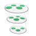

#  Ritc **flow**ground Connector

## Description

A generated **flow**ground connector for the Ritc API (version 1.0.0).

Generated from: https://api.apis.guru/v2/specs/ritc.io/1.0.0/swagger.json 
Generated at: 2019-05-07T17:43:54+03:00

## API Description

Rules in the Cloud

## Authorization

Supported authorization schemes:
- API Key
## Actions

### List actions

*Tags:* `Actions`

### Create a new action

*Tags:* `Actions`

### Delete an action

*Tags:* `Actions`

#### Input Parameters
* `action_id` - _required_ - Id of action

### Get an action

*Tags:* `Actions`

#### Input Parameters
* `action_id` - _required_ - Id of action_id

### Update information about a specific action

*Tags:* `Actions`

#### Input Parameters
* `action_id` - _required_ - Id of user

### Ping the server

*Tags:* `admin`

### Log a message

*Tags:* `admin`

### Ping the server

*Tags:* `admin`

### Get apps information

*Tags:* `Apps`

### Create a new app

*Tags:* `Apps`

### Get app channels

*Tags:* `Apps`

### Get users of a specified channel

*Tags:* `Apps`

#### Input Parameters
* `channel_id` - _required_ - Id of Channel

### Get user of a specified channel

*Tags:* `Apps`

#### Input Parameters
* `channel_id` - _required_ - Id of Channel
* `user_id` - _required_ - Id of User

### Create user channel

*Tags:* `Apps`

#### Input Parameters
* `channel_id` - _required_ - Id of Channel
* `user_id` - _required_ - Id of User

### Get external credentials

*Tags:* `Apps`

### Create new external credentials

*Tags:* `Apps`

### Delete credentials for a channel

*Tags:* `Apps`

#### Input Parameters
* `channel_id` - _required_ - Id of Channel

### Get credentials for a channel in an app

*Tags:* `Apps`

#### Input Parameters
* `channel_id` - _required_ - Id of Channel

### Update credentials for a channel

*Tags:* `Apps`

#### Input Parameters
* `channel_id` - _required_ - Id of Channel

### Run specified rule group in the app

*Tags:* `Apps`

#### Input Parameters
* `rule_id_list` - _required_ - Ids of rules in the group, separated by commas, no spaces
* `break_when_rule_fires` - _optional_ - Do not continue with remaining rules after a rule fires

### Run active app rules

*Tags:* `Apps`

#### Input Parameters
* `break_when_rule_fires` - _optional_ - Do not continue with remaining rules after a rule fires

### Delete an app

*Tags:* `Apps`

#### Input Parameters
* `app_id` - _required_ - Id of App

### Get app information

*Tags:* `Apps`

#### Input Parameters
* `app_id` - _required_ - Id of App

### Update an app

*Tags:* `Apps`

#### Input Parameters
* `app_id` - _required_ - Id of app

### Retrieve Channels

*Tags:* `Channels`

### Create a channel

*Tags:* `Channels`

### Retrieve Channels anonymously

*Tags:* `Channels`

### Delete a channel

*Tags:* `Channels`

#### Input Parameters
* `channel_id` - _required_ - Id of Channel

### Get channel information

*Tags:* `Channels`

#### Input Parameters
* `channel_id` - _required_ - Id of Channel

### Update a channel

*Tags:* `Channels`

#### Input Parameters
* `channel_id` - _required_ - Id of Channel

### Retrieve Channel Functions

*Tags:* `Channels`

#### Input Parameters
* `channel_id` - _required_ - Id of Channel

### Create a channel function

*Tags:* `Channels`

#### Input Parameters
* `channel_id` - _required_ - Id of Channel

### Get channel function information

*Tags:* `Channels`

#### Input Parameters
* `channel_id` - _required_ - Id of Channel
* `function_id` - _required_ - Id of Channel Function

### Create an org

*Tags:* `Orgs`

### Get org information

*Tags:* `Orgs`

### List rules

*Tags:* `Rules`

### Create a new rule

*Tags:* `Rules`

### Delete a rule

*Tags:* `Rules`

#### Input Parameters
* `rule_id` - _required_ - Id of rule

### Get a rule

*Tags:* `Rules`

#### Input Parameters
* `rule_id` - _required_ - Id of rule

### Update information about a specific rule

*Tags:* `Rules`

#### Input Parameters
* `rule_id` - _required_ - Id of user

### Run a rule

*Tags:* `Rules`

#### Input Parameters
* `rule_id` - _required_ - Id of rule

### Triggers in an app

*Tags:* `Triggers`

### Create a new trigger in an app

*Tags:* `Triggers`

### Delete a trigger

*Tags:* `Triggers`

#### Input Parameters
* `trigger_id` - _required_ - Id of Trigger

### Get a trigger

*Tags:* `Triggers`

#### Input Parameters
* `trigger_id` - _required_ - Id of Trigger

### Update a trigger

*Tags:* `Triggers`

#### Input Parameters
* `trigger_id` - _required_ - Id of user

### Users

*Tags:* `Users`

### Create a new App User

*Tags:* `Users`

### Admin users

*Tags:* `Users`

### Create a new admin user

*Tags:* `Users`

### Remove an admin user

*Tags:* `Users`

#### Input Parameters
* `user_id` - _required_ - Id of Admin_User

### Get an admin user

*Tags:* `Users`

#### Input Parameters
* `user_id` - _required_ - Id of Admin_User

### Update information about an admin user

*Tags:* `Users`

#### Input Parameters
* `user_id` - _required_ - Id of user

### Authenticate a user for a channel

*Tags:* `Users`

#### Input Parameters
* `user_id` - _required_ - Id of User
* `channel_id` - _required_ - Id of Channel

### Remove a user

*Tags:* `Users`

#### Input Parameters
* `user_id` - _required_ - Id of user

### Get an App User

*Tags:* `Users`

#### Input Parameters
* `user_id` - _required_ - Id of App User

### Update information about an App User

*Tags:* `Users`

#### Input Parameters
* `user_id` - _required_ - Id of user

### Channels available to a User

*Tags:* `Users`

#### Input Parameters
* `user_id` - _required_ - Id of user

### Assign a channel to a user

*Tags:* `Users`

#### Input Parameters
* `user_id` - _required_ - Id of user

### Remove a user channel assignment

*Tags:* `Users`

#### Input Parameters
* `user_id` - _required_ - Id of User
* `channel_id` - _required_ - Id of Channel

### Get a user channel

*Tags:* `Users`

#### Input Parameters
* `user_id` - _required_ - Id of User
* `channel_id` - _required_ - Id of Channel

### Rules for a User

*Tags:* `Users`

#### Input Parameters
* `user_id` - _required_ - Id of user

### Remove a rule user

*Tags:* `Users`

#### Input Parameters
* `user_id` - _required_ - Id of User
* `rule_id` - _required_ - Id of Rule

### Get a user

*Tags:* `Users`

#### Input Parameters
* `user_id` - _required_ - Id of User
* `rule_id` - _required_ - Id of Rule

### Assign a user to a rule

*Tags:* `Users`

#### Input Parameters
* `user_id` - _required_ - Id of User
* `rule_id` - _required_ - Id of Rule

### Run rule for a user

*Tags:* `Users`

#### Input Parameters
* `user_id` - _required_ - Id of User
* `rule_id` - _required_ - Id of Rule

## License

**flow**ground :- Telekom iPaaS / ritc-io-connector 
Copyright © 2019, [Deutsche Telekom AG](https://www.telekom.de) 
contact: flowground@telekom.de

All files of this connector are licensed under the Apache 2.0 License. For details
see the file LICENSE on the toplevel directory.
